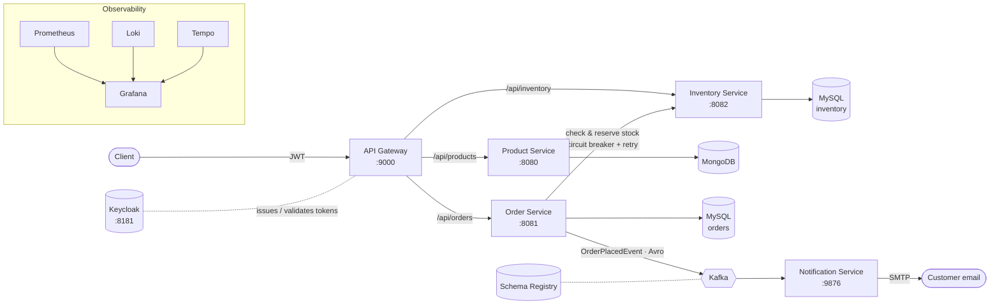
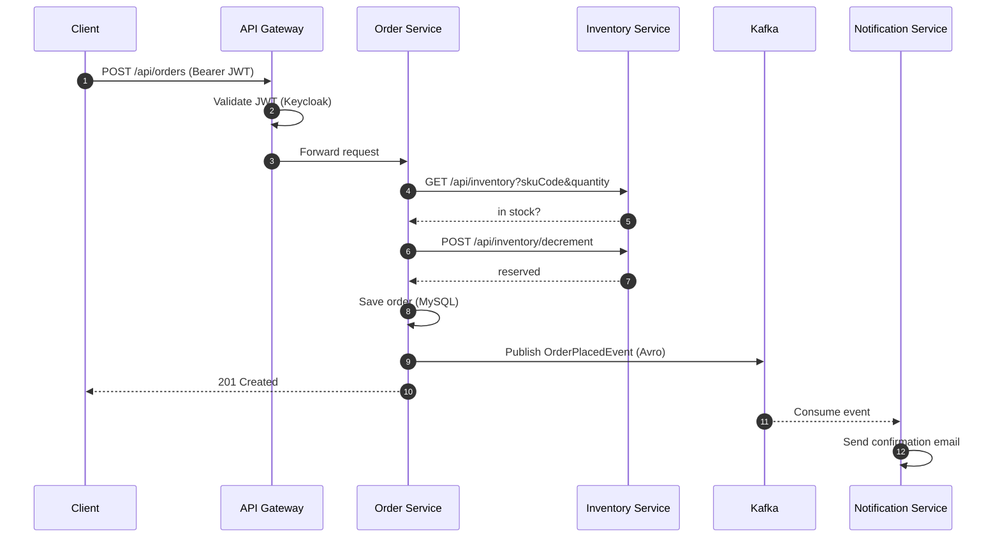

<div align="center">

# 🛒 Distributed E-commerce Microservices

**An e-commerce backend built as independent Spring Boot services. They talk through an API gateway, Kafka events and protected REST calls, and they are fully observable.**


<br/>


</div>

---

## ✨ Highlights

- **API gateway** (Spring Cloud Gateway, reactive) is the single entry point. It handles routing, CORS, retries and per-route **circuit breakers** with fallback responses.
- **Security** comes from **Keycloak** (OAuth2 / OpenID Connect). The gateway checks the JWT on every request.
- **Database per service**: **MongoDB** for the product catalog and **MySQL** for orders and inventory. Schemas are versioned with **Flyway**.
- **Synchronous calls with resilience**: order-service calls inventory-service through WebClient, protected by **Resilience4j** circuit breaker and retry.
- **Asynchronous events**: order-service publishes `OrderPlacedEvent` to **Kafka**, serialized with **Avro** and **Schema Registry**. notification-service consumes it and sends the confirmation email.
- **Observability across all services**: metrics in **Prometheus**, logs in **Loki**, distributed traces in **Tempo** (W3C trace context), all shown in **Grafana**. An AOP aspect logs how long every service method takes.
- **Aggregated Swagger UI**: one page at the gateway shows the OpenAPI docs of every service.
- **Docker Compose** has `dev` and `prod` overlays. Prod hides the database ports and sets resource limits. A **Makefile** wraps the common commands.
- **Tests**: JUnit 5, Mockito, **Testcontainers**, REST Assured and WireMock stubs (Spring Cloud Contract).

## 🏗️ Architecture



### Placing an order



When an order is cancelled, order-service calls `POST /api/inventory/restore` to put the stock back.

## 🧩 Services

| Service | Port | Storage | Responsibility |
|---|---|---|---|
| `api-gateway` | 9000 | - | Routing, JWT validation, circuit breakers, retries, aggregated Swagger |
| `product-service` | 8080 | MongoDB | Product CRUD, search by name and price range, lookup by SKU |
| `order-service` | 8081 | MySQL + Flyway | Place, list, get and cancel orders; publishes `OrderPlacedEvent` |
| `inventory-service` | 8082 | MySQL + Flyway | Stock checks, decrement and restore |
| `notification-service` | 9876 | - | Kafka consumer that sends order confirmation emails |

### Main endpoints (through the gateway)

| Method | Path | Description |
|---|---|---|
| `POST` `GET` | `/api/products` | Create product, list products |
| `GET` `PUT` `DELETE` | `/api/products/{id}` | Get, update or delete a product |
| `GET` | `/api/products/search` · `/api/products/search/price` | Search by name or price range |
| `GET` | `/api/products/sku/{skuCode}` | Lookup by SKU |
| `POST` `GET` | `/api/orders` | Place an order, list orders |
| `GET` `DELETE` | `/api/orders/{orderNumber}` | Order details, cancel order |
| `GET` | `/api/inventory?skuCode=&quantity=` | Is it in stock? |
| `POST` | `/api/inventory/decrement` · `/api/inventory/restore` | Reserve or release stock |

Full interactive docs: **http://localhost:9000/swagger-ui/index.html**

## 🚀 Getting started

**Requirements:** Docker Desktop, Java 21, GNU Make (Git Bash / WSL works).

```bash
# 1. Configure secrets
cp .env.example .env.dev        # then edit the passwords and Mailtrap SMTP credentials

# 2. Start the whole stack (infra + all services) in dev mode
make dev

# 3. Check that every service is healthy
make health
```

Or run the services from your IDE or JVM against containerized infrastructure:

```bash
make infra-up          # MongoDB, MySQL, Kafka, Schema Registry, Keycloak, Grafana stack
make build
make run-product       # also: run-order, run-inventory, run-notification, run-gateway
```

Run `make help` to see every target.

### Useful URLs (dev)

| Tool | URL |
|---|---|
| Swagger UI (all services) | http://localhost:9000/swagger-ui/index.html |
| Keycloak admin | http://localhost:8181 |
| Grafana | http://localhost:3000 |
| Prometheus | http://localhost:9090 |
| Schema Registry | http://localhost:8085 |

## 📈 Observability

Every service exposes `/actuator/prometheus` and sends logs to **Loki** with the trace id attached.
Traces cross service boundaries (gateway → order → inventory → Kafka → notification),
so you can open one request in **Tempo** and see the whole path, then jump from a trace to its logs in Grafana.
Business operations such as `order.place` and `notification.orderPlaced` are instrumented with `@Observed`.

## 🧪 Testing

```bash
make test
```

- Unit tests for services and controllers (JUnit 5, Mockito, MockMvc)
- Integration tests with **Testcontainers** (real MongoDB, MySQL and Kafka)
- Inventory calls stubbed with **WireMock** (Spring Cloud Contract stub runner) and checked with REST Assured

## 🗺️ Roadmap

- [ ] Check prices against product-service instead of trusting the client
- [ ] Transactional outbox for `OrderPlacedEvent` (exactly-once handoff between DB and Kafka)
- [ ] Saga with compensation instead of the synchronous stock reservation
- [ ] Kubernetes manifests / Helm chart
- [ ] CI pipeline (build, test, image publish)

---

<div align="center">

Built by **[Michael Saad](https://github.com/michaelsaad)** · [LinkedIn](https://www.linkedin.com/in/michael-bareh/)

</div>
